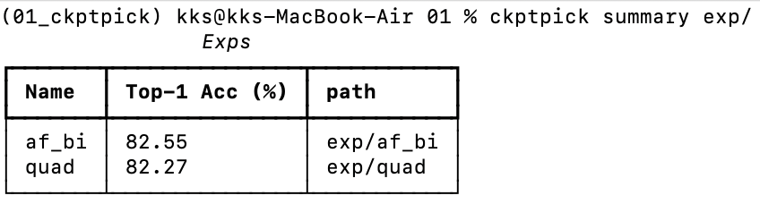
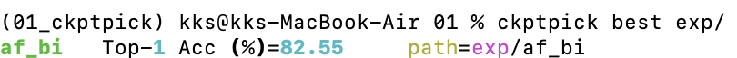

# ckptpick
학습 log directory에서 실험별 검증 정확도를 모아 보여주는 CLI.
## 설치
```
pip install -e .
```
## 사용
```
ckptpick summary exp/
ckptpick best exp/

- `summary`: 각 실험의 `val_acc1`을 정리하여 표의 형태로 출력
- `best`: `val_acc1`이 가장 높은 실험의 정보를 출력
```
## val_acc1란?
각 실험 directory(`exp/<name>/`) 안의 `log_rank0.txt`에서 마지막으로 등장한
- `INFO Max accuracy: {acc}%` (원 모델)
- `Info Max accuracy ema: {acc_ema}%` (EMA 모델)
두 값 중 큰 값을 `val_acc1`으로 사용한다.
## 실행 예시
### `ckptpick summary exp/`

### `ckptpick best exp/`
