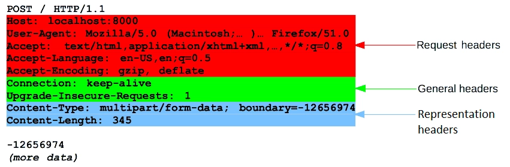
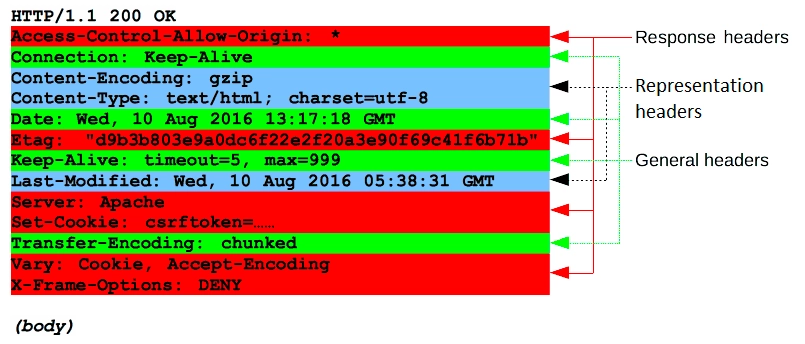

# HTTP
## 정의
HyperText Transfer Protocol의 약어로, **구조화된 HyperText(html, css, js, png, jpeg 등)를 전송하기 위해 사용되는 통신 규약**
## 사용 이유
다양한 웹 서버와 클라이언트가 매 번 새로운 통신 방법을 사용하지 않고, **정의된 규칙에 따라 문서를 표준화하여 주고 받기 위해 사용**한다.
## HTTP Message
### 정의
**Client와 Server 간에 데이터를 주고 받는 통신의 기본 단위**로, **Request**(요청: Client $\rightarrow$ Server)과 **Response**(응답: Server $\rightarrow$ Client)으로 분류된다.
### 구조
Start Line, Headers, Empty Line, Body로 구성
1. Start Line: Request/Response의 status를 나타내는 첫 줄
2. Headers: Body를 요약하는 header들의 집합
3. Empty Line: Header와 Body를 구분하는 빈 줄
4. Body: HTML 또는 JSON과 같은 형식의 데이터나 문서 등 실제 내용이 담기는 부분

- Request/Response Headers
	- Request/Response을 보낼 때 함께 전송되는 header
	- Request/Response의 성격과 목적, 부가적인 정보를 제공
- General Headers
	- Request와 Response 모두에서 사용되는 일반적인 header
	- 메시지 전체에 대한 정보를 제공
- Representation Headers
	- Body와 관련된 header
	- 데이터의 형식, 언어, 압축 등을 나타냄
	- Client와 Server가 데이터를 올바르게 해석하고 처리할 수 있도록 도움
## Request Method
Web server에 어떤 작업을 수행하길 원하는 지 알리는 방법을 정의하는 규칙
- GET
	- 데이터 **요청**
	- Body X
	- 예시) 웹 브라우저에 URL 입력, 데이터 조회, 검색, ...
- POST
	- 데이터 **생성**
	- Body에 데이터를 첨부하여 전송
	- Server는 POST 요청을 받으면 데이터를 parsing 하고, 요청에 따른 처리를 수행한 후 client에 응답을 보냄
	- 예시) 회원 가입, 새 게시글 작성, ...
- PUT
	- 데이터 **전체 업데이트**
	- POST_2-3과 동일
- PATCH
	- 데이터 **부분 업데이트**
	- POST_2-3과 동일
- DELETE
	- 데이터 **삭제**
## Status Code
### 정의
Client가 web server에 요청을 했을 때, 통신의 결과를 web server과 client에게 전달하는 코드
- 1xx: 정보 메시지
- 2xx: 성공
- 3xx: Redirection(주소지 이전 등)
- 4xx: Client 측 Error
- 5xx: Server 측 Error
## URL
### 정의
Uniform Resource Locator의 약어로, 웹상에서의 고유한 리소스 주소
### 예시
http://www.example.kr:80/path/to/example.html?key1=value1&key2=value2
#### Scheme
`http` 부분으로, 리소스를 요청할 때 사용해야 하는 프로토콜
#### Domain, Port
`www.example.kr`과 `80` 부분으로, 텍스트 형태의 주소와 게이트
#### Resource 경로
`path/to/example.html` 부분으로, web server 내에서의 리소스 경로
#### Parameter
`?key1=value1&key2=value2` 부분으로, web server에 전달하는 추가 변수